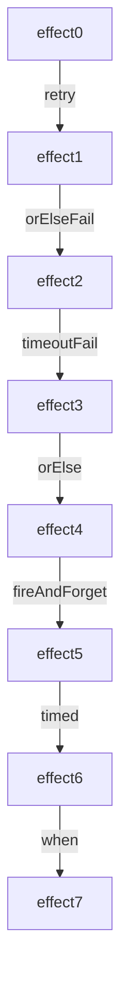

# Superpowers with Effects

{{ TODO: More consistent error messages }}

```scala mdoc:invisible
enum Scenario:
  case HappyPath
  case NeverWorks
  case Slow
  case WorksOnTry(attempts: Int, ref: Ref[Int])

// This configuration is used by effects to get the scenario that
// may have been passed in via `bootstrap`
// The configuration is optional and the default of `Config.fail`
// sets the Option to None.
val scenarioConfig: Config[Option[Scenario]] =
  Config.Optional[Scenario](
    Config.fail("no default scenario")
  )

class StaticConfigProvider(scenario: Scenario)
    extends ConfigProvider:
  override def load[A](config: Config[A])(
      implicit trace: Trace
  ): IO[Config.Error, A] =
    ZIO.succeed(Some(scenario).asInstanceOf[A])

val happyPath =
  Runtime.setConfigProvider(
    StaticConfigProvider(Scenario.HappyPath)
  )

val neverWorks =
  Runtime.setConfigProvider(
    StaticConfigProvider(Scenario.NeverWorks)
  )

val slow =
  Runtime.setConfigProvider(
    StaticConfigProvider(Scenario.Slow)
  )

val doesNotWorkInitially =
  val scenario =
    Unsafe.unsafe {
      implicit unsafe =>
        Scenario.WorksOnTry(
          3,
          Runtime
            .default
            .unsafe
            .run(Ref.make(1))
            .getOrThrow()
        )
    }
  Runtime.setConfigProvider(
    StaticConfigProvider(scenario)
  )

def saveUser(username: String) =
  val succeed =
    ZIO.succeed:
      "User saved"
  val fail =
    ZIO
      .fail:
        "**Database crashed!!**"
      .tapError:
        error =>
          Console.printLine:
            "Log: " + error
  defer:
    val maybeScenario =
      ZIO.config(scenarioConfig).run
    maybeScenario
      .getOrElse(Scenario.HappyPath) match
      case Scenario.HappyPath =>
        succeed.run

      case Scenario.NeverWorks =>
        fail.run

      case Scenario.Slow =>
        ZIO
          .sleep(1.minute)
          .onInterrupt:
            ZIO.debug(
              "Log: Interrupting slow request"
            )
          .run
        succeed.run

      case Scenario.WorksOnTry(attempts, ref) =>
        val numCalls =
          ref.getAndUpdate(_ + 1).run
        if numCalls == attempts then
          succeed.run
        else
          fail.run
    end match
end saveUser

def sendToManualQueue(username: String) =
  ZIO.attempt(
    s"Please manually provision $username"
  )

val logUserSignup =
  Console
    .printLine:
      s"Log: Signup initiated for $userName"
    .orDie

// TODO Decide how much to explain this in the
// prose,
// without revealing the implementation
extension [R, E, A](z: ZIO[R, E, A])
  def fireAndForget(
      background: ZIO[R, Nothing, Any]
  ) =
    z.zipParLeft(background.forkDaemon)
```

Once programs are defined in terms of Effects, we use operations from the Effect System to manage different aspects of unpredictability.
Combining Effects with these operations feels like a superpower.
The reason we call them "superpowers" is that the operations can be attached to **any** Effect.
Operations can even be chained together.

Common operations like `timeout` are applicable to all Effects while some operations like `retry` are only applicable to a subset of Effects.

Ultimately this means we do not need to create bespoke operations for the many different Effects our system may have.

To illustrate this we will show a few examples of common operations applied to Effects.
Let's start with the "happy path" where we save a user to a database
(an Effect)
and then gradually add superpowers.

To start with we save a user to a database:

```scala mdoc:silent
val userName =
  "Morty"
```

```scala mdoc:silent
val effect0 =
  saveUser:
    userName
```

Effects can be run as "main" programs, embedded in other programs, or in tests.
To run an Effect with ZIO as a "main" program, we normally do this:

```scala
object MyApp extends ZIOAppDefault:
  def run =
    effect0
```

In this book, to avoid the excess lines, we shorten this to:

```scala mdoc:runzio
def run =
  effect0
```

By default, the `saveUser` Effect runs in the "happy path" so it will not fail.

We can explicitly specify the way in which this Effect will run by overriding the `bootstrap` value:

```scala mdoc:runzio
override val bootstrap =
  happyPath

def run =
  effect0
```

Overriding the `bootstrap` value simulates failures in the following examples.

In real systems, assuming the "happy path" causes strange unhandled errors.

We can also run a scenario that causes failure:

```scala mdoc:runzio
override val bootstrap =
  neverWorks

def run =
  effect0
```

The program logs and returns the failure.

## Superpower: Persevering Through Failure

Sometimes things work when you keep trying.  
We can retry `effect0` with the `retryN` operation:

```scala mdoc:silent
val effect1 =
  effect0.retryN(2)
```

The Effect with the retry behavior becomes a new Effect and can optionally be assigned to a `val` (as is done here).

Now we run the new Effect in a scenario that works on the third try:

```scala mdoc:runzio
override val bootstrap =
  doesNotWorkInitially

def run =
  effect1
```

The output shows that running the Effect worked after two retries.

### What If It Never Succeeds?

In the `neverWorks` scenario, the Effect fails its initial attempt and subsequent retries:

```scala mdoc:runzio
override val bootstrap =
  neverWorks

def run =
  effect1
```

After the failed retries, the program returns the error.

## Superpower: Nice Error Messages

Let's define a new Effect that chains a nicer error onto the previously defined operations (the retries) using `orElseFail` which transforms any failure into a user-friendly error:

```scala mdoc:silent
val effect2 =
  effect1.orElseFail:
    "ERROR: User could not be saved"
```

We altered the behavior without restructuring the original Effect.
Running this new Effect in the `neverWorks` scenario will produce the error:

```scala mdoc:runzio
override val bootstrap =
  neverWorks

def run =
  effect2
```

The `orElseFail` is combined with the prior Effect that has the retry,
  creating another new Effect that has both error handling operations.

## Superpower: Imposing Time Limits

Sometimes an Effect fails quickly, as we saw with retries.
Sometimes an Effect taking too long is itself a failure.
The `timeoutFail` operation can be chained to our previous Effect to specify a maximum time the Effect can run for, before producing an error:

```scala mdoc:silent
val effect3 =
  effect2.timeoutFail("*** Save timed out ***"):
    5.seconds
```

If the effect does not complete within the time limit, it is canceled and returns our error message.
Timeouts can be added to any Effect.

Running the new Effect in the `slow` scenario causes it to take longer than the time limit:

```scala mdoc:runzio
override val bootstrap =
  slow

def run =
  effect3
```

The Effect took too long and produced the error.

## Superpower: Fallback From Failure

In some cases there may be fallback behavior for failed Effects.
One option is to use the `orElse` operation with a fallback Effect:

```scala mdoc:silent
val effect4 =
  effect3.orElse:
    sendToManualQueue:
      userName
```

`sendToManualQueue` represents something we can do when the user can't be saved.

Let's run the new Effect in the `neverWorks` scenario to ensure we reach the fallback:

```scala mdoc:runzio
override val bootstrap =
  neverWorks

def run =
  effect4
```

The retries do not succeed so the user is sent to the fallback Effect.

## Superpower: Add Some Logging

TODO Should we convert this to an `acquireRelease` example? That would:
- Introduce this before we leverage it in our Kitchen oven example
- Get rid of hidden/confusing extension method.

Effects can be run concurrently and as an example,
  we can at the same time as the user is being saved,
  send an event to another system.

```scala mdoc:silent
val effect5 =
  effect4.fireAndForget:
    logUserSignup
```

`fireAndForget` is a convenience method we defined (in hidden code) that makes it easy to run two effects in parallel and ignore any failures on the `logUserSignup` Effect.

```scala mdoc:runzio
override val bootstrap =
  happyPath

def run =
  effect5
```

We run the effect again in the `HappyPath` scenario to demonstrate running the Effects in parallel.

We can add all sorts of custom behavior to our Effect type,
  and then invoke them regardless of error and result types.

## Superpower: How Long Do Things Take?

For diagnostic information you can track timing:

```scala mdoc:silent
val effect6 =
  effect5.timed
```

```scala mdoc:runzio
override val bootstrap =
  happyPath

def run =
  effect6
```

We run the Effect in the "HappyPath" Scenario; now the timing information is packaged with the original output `String`.

## Superpower: Maybe We Don't Want To Run Anything

Now that we have added all of these superpowers to our process,
  our lead engineer lets us known that a certain user should be prevented from using our system.

```scala mdoc:silent
val effect7 =
  effect6.when(userName != "Morty")
```

```scala mdoc:runzio
override val bootstrap =
  happyPath

def run =
  effect7
```

We can add behavior to the end of our complex Effect,
  that prevents it from ever executing in the first place.

## Many More Superpowers

{{ todo: make rendering in manuscript work }}



These examples have shown only a glimpse into the superpowers we can add to **any** Effect.
There are even more we will explore in the following chapters.

## Deferred Execution Enables many of the Superpowers

If these effects were all executed immediately, we would not be able to freely tack on new behaviors.
We cannot timeout something that might have already started running, or even worse - completed, before we get our hands on it.
We cannot retry something if we are only holding on to the completed result.
We cannot parallelize operations if they have already started single-threaded execution.

We need to be holding on to a value that represents something that _can_ be run, but hasn't yet.
If we have that, then our Effect System can freely add behavior before/after that value.

### defer/run example

When we make a defer block, nothing inside of it will be executed yet.

```scala mdoc:silent
val program =
  defer:
    Console.printLine("Hello").run
    val subject =
      "world"
    Console.printLine(subject).run
```

The `.run` method is only available on our Effect values.
We explicitly call `.run` whenever we want to sequence our effects.
If we do not call `.run`, then we are just going to have an un-executed effect.
We want this explicit control, so that we can manipulate our effects up until it is time to run them.

For example, we can repeat our un-executed effect:

```scala mdoc:silent
val programManipulatingBeforeRun =
  defer:
    Console.printLine("Hello").repeatN(3).run
```

We _cannot_ repeat our executed effect.

```scala mdoc:fail
val programManipulatingBeforeRun =
  defer:
    Console.printLine("Hello").run.repeatN(3)
```

Note that these calls to `.run` are all within a `defer` block, so when `program` is defined, we still have not actually executed anything.
We have described a program that knows the order in which to execute our individual effects _when the program is executed_.

```scala mdoc:silent
val surroundedProgram =
  defer:
    Console.printLine("**Before**").run
    program.run
    Console.printLine("**After**").run
```

Even now, we have not executed anything.
It is only when we pass our completed program over to the effect system that the program is executed.

```scala mdoc:runzio
def run =
  surroundedProgram
```

```scala mdoc:fail
// TODO Decide where to put this
val program =
  defer:
    println("hi").run
    (1 + 1).run
```

### Explain the 2 versions of run and how they came to be
