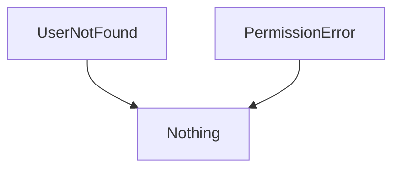
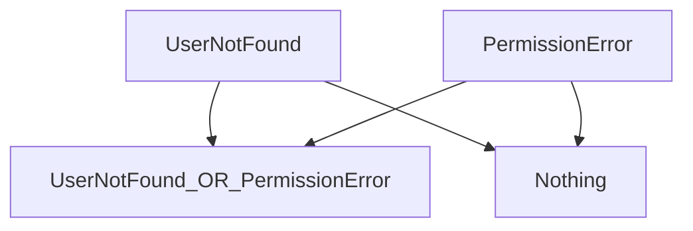
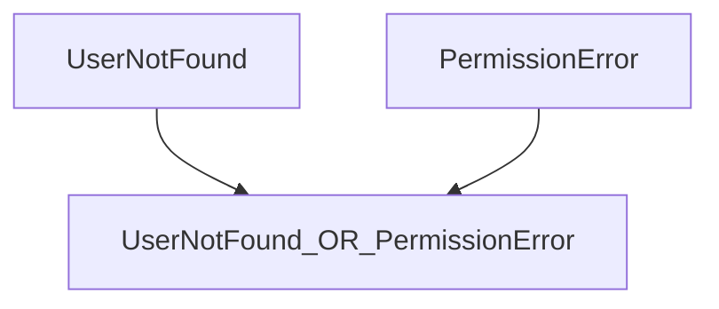
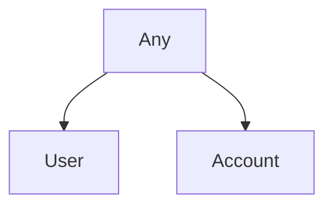

# And / Or

## Unions AKA Sum Types AKA Enums AKA Ors

Note - Avoid official terminology in most prose. Just say "And"/"Or" where appropriate.

Scala 3 automatically aggregates the error types by synthesizing an anonymous sum type from the combined errors.

Functions usually transform the `Answer` from one type to another type.  Errors often aggregate.


```scala mdoc
trait Error1
trait Error2

def failableFunction()
    : ZIO[Any, Error1 | Error2, Unit] = ???
```
Consider 2 error types

```scala mdoc
trait UserNotFound
trait PermissionError
```

In the type system, the most recent ancestor between them is `Any`.  
Unfortunately, you cannot make any meaningful decisions based on this type.



We need a more specific way to indicate that our code can fail with either of these types.
The `|` (or) tool provides maximum specificity without the need for inheritance.

*TODO* Figure out how to use pipe symbol in Mermaid



Often, you do not care that `Nothing` is involved at all.
The mental model can be simply:



```scala mdoc
trait User
trait SuperUser

def getUser(
    userId: String
): ZIO[UserService, UserNotFound, User] = ???
def getSuperUser(
    user: User
): ZIO[UserService, PermissionError, SuperUser] =
  ???

def loginSuperUser(userId: String): ZIO[
  UserService,
  UserNotFound | PermissionError,
  SuperUser
] =
  defer {
    val basicUser = getUser(userId).run
    getSuperUser(basicUser).run
  }

trait Status
trait NetworkService

def statusOf(
    user: User
): ZIO[NetworkService, UserNotFound, Status] =
  ???

def check(userId: String): ZIO[
  UserService & NetworkService,
  UserNotFound,
  Status
] =
  defer {
    val user = getUser(userId).run
    statusOf(user).run
  }
```


## Intersections AKA Products AKA Case Classes AKA Ands



```scala mdoc
trait Piece1
trait Piece2

def needyFunction()
    : ZIO[Piece1 & Piece1, Nothing, Unit] = ???
```

For your `Answer`, it can be desirable to give a clear name that is relevant to your domain.

The requirements for each ZIO are combined as an anonymous product type denoted by the `&` symbol.

```scala mdoc

```

```scala mdoc
trait AccountService
trait UserService
```

```scala mdoc
trait Account
trait AccountError

def userToAccount(
    user: User
): ZIO[AccountService, AccountError, Account] =
  ???

def getAccount(userId: String): ZIO[
  UserService & AccountService,
  AccountError | UserNotFound,
  Account
] =
  defer {
    val user = getUser(userId).run
    userToAccount(user).run
  }
```

```
case class SomeServices(userService: UserService, accountService: AccountService)

//trait SomeServices extends UserService with AccountService
```

You have the ability to handle all the possible errors from your logic without needing to create a new name that encompasses all of them.

