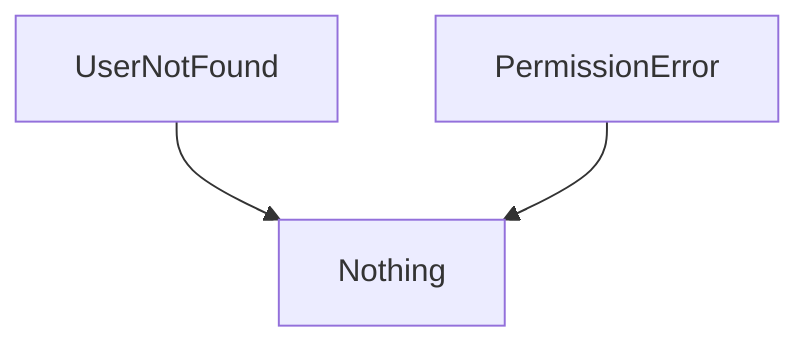
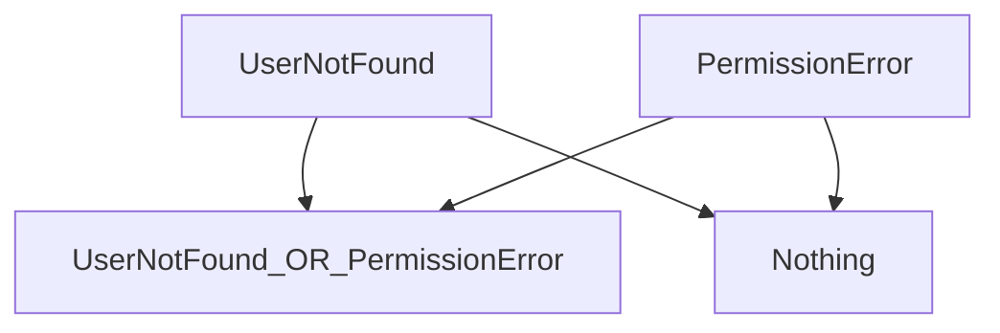
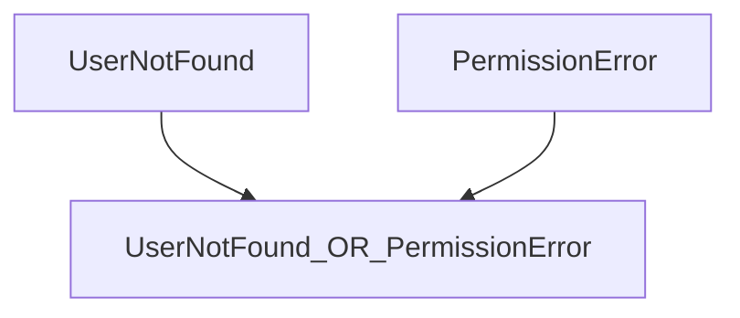

# Errors

1. Creating & Handling
1. Error composability
1. Retry

In a language that cannot `throw`, following the execution path is simple, following 2 basic rules:

    - At a branch, execute only the first match
    - Otherwise, Read everything from left-to-right, top-to-bottom, 

Once you add `throw`, the rules are more complicated

    - At a branch, execute only the first match
    - Otherwise, Read everything from left-to-right, top-to-bottom,
    - Unless we `throw`, which means immediately jumping through a different dimension away from the code you're viewing


## Historic approaches to Error-handling
If you are not interested in the discouraged ways to handle errors, and just want to see the ZIO approach, jump down to
[ZIO Error Handling](#zio-error-handling)

In the past, some programs have thrown exceptions to indicate failures.
Imagine a program that displays the local temperature the user based on GPS position and a network call. There are distinct levels of problems in any given program. They require different types of handling by the programmer.

```text
Temperature: 30 degrees
```

```scala mdoc
class GpsException()     extends RuntimeException
class NetworkException() extends RuntimeException

enum Scenario:
  case Success,
    NetworkError,
    GPSError

def render(value: String) =
  s"Temperature: $value"

def calculateTemp(behavior: Scenario): String =
  behavior match
    case Scenario.GPSError =>
      throw GpsException()
    case Scenario.NetworkError =>
      throw NetworkException()
    case Scenario.Success =>
      "35 degrees"
```

```scala mdoc
def currentTemperatureUnsafe(
    behavior: Scenario
): String =
  render:
    calculateTemp:
      behavior

currentTemperatureUnsafe:
  Scenario.Success
```

On the happy path, everything looks as desired.
If the network is unavailable, what is the behavior for the caller?
This can take many forms.
If we don't make any attempt to handle our problem, the whole program blows up and shows the gory details to the user.

```scala mdoc:crash
// Note - Can't make this output prettier/simpler because it's *not* using ZIO
currentTemperatureUnsafe:
  Scenario.NetworkError
```

We could take the bare-minimum approach of catching the `Exception` and returning `null`:

```scala mdoc
def currentTemperatureNull(
    behavior: Scenario
): String =
  render:
    try
      calculateTemp:
        behavior
    catch
      case ex: RuntimeException =>
        null

currentTemperatureNull:
  Scenario.NetworkError
```

This is *slightly* better, as the user can at least see the outer structure of our UI element, but it still leaks out code-specific details world.

Maybe we could fallback to a `sentinel` value, such as `0` or `-1` to indicate a failure?

```scala mdoc:nest
def currentTemperature(
    behavior: Scenario
): String =
  render:
    try
      calculateTemp:
        behavior
    catch
      case ex: RuntimeException =>
        "-1 degrees"

currentTemperature:
  Scenario.NetworkError
```

Clearly, this isn't acceptable, as both of these common sentinel values are valid temperatures.
We can take a more honest and accurate approach in this situation.

```scala mdoc:nest
def currentTemperature(
    behavior: Scenario
): String =
  render:
    try
      calculateTemp:
        behavior
    catch
      case ex: RuntimeException =>
        "Unavailable"

currentTemperature:
  Scenario.NetworkError
```

We have improved the failure behavior significantly; is it sufficient for all cases?
Imagine our network connection is stable, but we have a problem in our GPS hardware.
In this situation, do we show the same message to the user? Ideally, we would show the user a distinct message for each scenario.
The Network issue is transient, but the GPS problem is likely permanent.

```scala mdoc:nest
def currentTemperature(
    behavior: Scenario
): String =
  try
    render:
      calculateTemp:
        behavior
  catch
    case ex: NetworkException =>
      "Network Unavailable"
    case ex: GpsException =>
      "GPS problem"

currentTemperature:
  Scenario.NetworkError

currentTemperature:
  Scenario.GPSError
```

Wonderful!
We have specific messages for all relevant error cases. However, this still suffers from downsides that become more painful as the codebase grows.

- The signature of `currentTemperature` does not alert us that it might fail
- If we realize it can fail, we must dig through the implementation to discover the multiple failure values
- We never have certainty about the failure paths of our full application, or any subset of it.

{{ TODO Tear apart exceptions more }}

Encountering an error during a function call generally means two things:

1. You can't continue executing the function in the normal fashion.

2. You can't return a normal result.

Many languages use *exceptions* for handling errors.
An exception *throws* out of the current execution path to locate a user-written *handler* to deal with the error.
There are two goals for exceptions:

1. Separate error-handling code from "success-path" code, so the success-path code is easier to understand and reason about.

2. Reduce redundant error-handling code by handling associated errors in a single place.

Exceptions have problems:

1. They can be "swallowed."
   Just because code throws an exception, there's no guarantee that issue will be dealt with.

1. They can lose important information.
   Once an exception is caught, it is considered to be "handled," and the program doesn't need to retain the failure information.

1. They aren't typed.
   Java's checked exceptions provide a small amount of type information, but it's not that helpful compared to a full type system.
   Unchecked exceptions provide no information at all.

1. Because they are handled dynamically, the only way to ensure your program
   won't crash is by testing it through all possible execution paths. A
   statically-typed error management solution can ensure---at compile
   time---that all errors are handled.

1. They don't scale.
   {{Need to think about this more to make the case.}}

1. Hard to reason about. {{Also need to make this case}}

1. Difficult or impossible to retry an operation if it fails.
   Java {{and Scala?}} use the "termination" model of exception handling.
   This assumes the error is so critical there's no way to get back to where the exception occurred.
   If you're performing an operation that you'd like to retry if it fails, exceptions don't help much.

Exceptions were a valiant attempt to produce a consistent error-reporting interface, and they are definitely better than what's in C.
But they don't end up solving the problem very well, and you just don't know what you're going to get when you use exceptions.


### What's wrong with Try?

### ADTS as another step forward

## ZIO Error Handling

Now we will explore how ZIO enables more powerful, uniform error-handling.

TODO {{Update verbiage now that ZIO section is first}}

- [ZIO Error Handling](#zio-error-handling)
- [Wrapping Legacy Code](#wrapping-legacy-code)

{#zio-error-handling}
### ZIO-First Error Handling

```scala mdoc
def getTemperatureZ(behavior: Scenario): ZIO[
  Any,
  GpsException | NetworkException,
  String
] =
  behavior match
    case Scenario.GPSError =>
      ZIO.fail:
        GpsException()
    case Scenario.NetworkError =>
      // TODO Use a non-exceptional error
      ZIO.fail:
        NetworkException()
    case Scenario.Success =>
      ZIO.succeed:
        "35 degrees"

runDemo:
  getTemperatureZ:
    Scenario.Success
```

```scala mdoc:fail
// TODO make MDoc:fail adhere to line limits?
runDemo:
  getTemperatureZ:
    Scenario.Success
  .catchAll:
    case ex: NetworkException =>
      ZIO.succeed:
        "Network Unavailable"
```

TODO Demonstrate ZIO calculating the error types without an explicit annotation being provided

```scala mdoc
runDemo:
  getTemperatureZ:
    Scenario.GPSError
```

{#wrapping-legacy-code}
### Wrapping Legacy Code

If we are unable to re-write the fallible function, we can still wrap the call
We are re-using the  `calculateTemp`

{{TODO }}

```scala mdoc
def calculateTempWrapped(
    behavior: Scenario
): ZIO[Any, Throwable, String] =
  ZIO.attempt:
    calculateTemp:
      behavior
```


```scala mdoc
def displayTemperatureZWrapped(
    behavior: Scenario
): ZIO[Any, Nothing, String] =
  calculateTempWrapped:
    behavior
  .catchAll:
    case ex: NetworkException =>
      ZIO.succeed:
        "Network Unavailable"
    case ex: GpsException =>
      ZIO.succeed:
        "GPS problem"
```

```scala mdoc
runDemo:
  displayTemperatureZWrapped:
    Scenario.Success
```

```scala mdoc
runDemo:
  displayTemperatureZWrapped:
    Scenario.NetworkError
```

This is decent, but does not provide the maximum possible guarantees. Look at what happens if we forget to handle one of our errors.

```scala mdoc
def getTemperatureZGpsGap(
    behavior: Scenario
): ZIO[Any, Nothing, String] =
  calculateTempWrapped:
    behavior
  .catchAll:
    case ex: NetworkException =>
      ZIO.succeed:
        "Network Unavailable"
```

```scala mdoc
runDemo:
  getTemperatureZGpsGap:
    Scenario.GPSError
```

The compiler does not catch this bug, and instead fails at runtime.
Take extra care when interacting with legacy code, since we cannot automatically recognize these situations at compile time.
We have 2 options in these situations.

First, we can provide a fallback case that will report anything we missed:

```scala mdoc
def getTemperatureZWithFallback(
    behavior: Scenario
): ZIO[Any, Nothing, String] =
  calculateTempWrapped:
    behavior
  .catchAll:
    case ex: NetworkException =>
      ZIO.succeed:
        "Network Unavailable"
    case other =>
      ZIO.succeed:
        "Error: " + other
```

```scala mdoc
runDemo:
  getTemperatureZWithFallback:
    Scenario.GPSError
```

This lets us avoid the most egregious gaps in functionality, but it does not take full advantage of ZIO's type-safety.

```scala mdoc
def getTemperatureZAndFlagUnhandled(
    behavior: Scenario
): ZIO[Any, GpsException, String] =
  calculateTempWrapped:
    behavior
  .catchSome:
    case ex: NetworkException =>
      ZIO.succeed:
        "Network Unavailable"
    // TODO Eh, find a better version of this.
  .mapError(_.asInstanceOf[GpsException])
```

```scala mdoc
runDemo:
  getTemperatureZAndFlagUnhandled:
    Scenario.GPSError
```


{{TODO show catchSome}}

> Note: The following is copy&pasted and needs work

## Unions AKA Sum Types AKA Enums AKA Ors

Note - Avoid official terminology in most prose. Just say "And"/"Or" where appropriate.

Scala 3 automatically aggregates the error types by synthesizing an anonymous sum type from the combined errors.

Functions usually transform the `Answer` from one type to another type.  Errors often aggregate.


```scala
trait Error1
trait Error2

def failableFunction()
    : ZIO[Any, Error1 | Error2, Unit] = ???
```
Consider 2 error types

```scala
trait UserNotFound
trait PermissionError
```

In the type system, the most recent ancestor between them is `Any`.  
Unfortunately, you cannot make any meaningful decisions based on this type.



We need a more specific way to indicate that our code can fail with either of these types.
The `|` (or) tool provides maximum specificity without the need for inheritance.

*TODO* Figure out how to use pipe symbol in Mermaid



Often, you do not care that `Nothing` is involved at all.
The mental model can be simply:



```scala
case class UserService()
```

```scala
trait User
trait SuperUser

def getUser(
    userId: String
): ZIO[UserService, UserNotFound, User] = ???
def getSuperUser(
    user: User
): ZIO[UserService, PermissionError, SuperUser] =
  ???

def loginSuperUser(userId: String): ZIO[
  UserService,
  UserNotFound | PermissionError,
  SuperUser
] =
  defer:
    val basicUser = getUser(userId).run
    getSuperUser(basicUser).run

trait Status
trait NetworkService

def statusOf(
    user: User
): ZIO[NetworkService, UserNotFound, Status] =
  ???

def check(userId: String): ZIO[
  UserService & NetworkService,
  UserNotFound,
  Status
] =
  defer:
    val user = 
      getUser:
        userId
      .run
    statusOf:
      user
    .run
```
