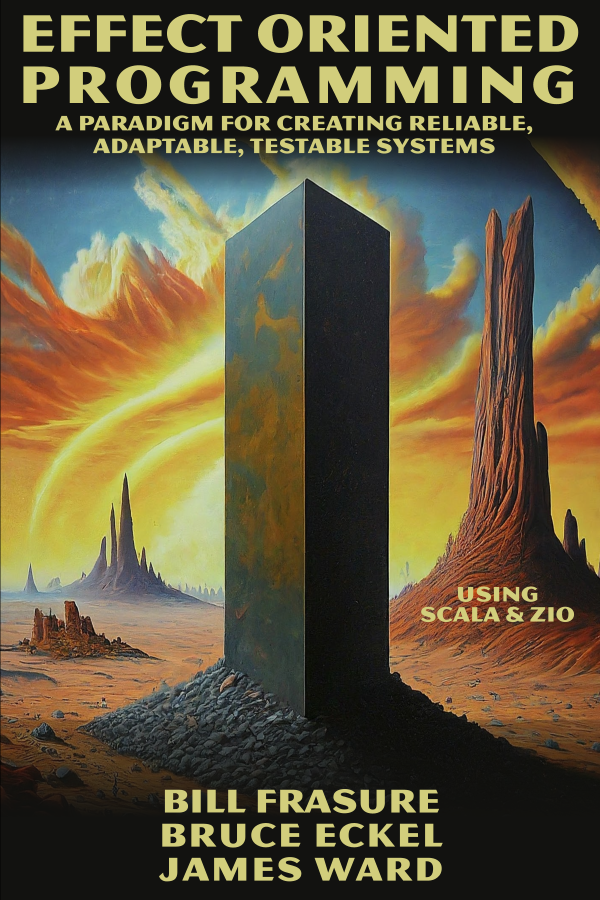

---
hide:
- navigation
- toc
---

# 

## A Paradigm for Creating Reliable, Adaptable, Testable Systems - Using Scala and ZIO

Have you been wondering what makes functional programming such a big deal, but you haven't been able to get through any of the explanations? We wrote this book for you.

Four years in the making!

Phone-friendly: the code listings are easily readable without phone gymnastics.

This is a small book—it took an enormous amount of effort to make it so!

---

Effects are the unpredictable elements in your programs.

Concerns like network communication or user interaction might seem easy, but they are devilishly difficult to get right. The pristine world of algorithms devolves into the gory reality of failures and inconsistency.

Traditionally, we've coped with Effects incompletely and often unwittingly. Programs have been difficult to build, adapt, and maintain.

Discover a groundbreaking approach to software development using Effect Systems to control the unpredictable elements in your systems. We focus on practical techniques you can apply immediately, making complex concepts accessible to all developers. You'll learn resilient system development in a straightforward, pragmatic way, using simplified code examples and clear explanatory prose.

---

Authors: [Bill Frasure](https://leanpub.com/u/billfrasure), [Bruce Eckel](https://leanpub.com/u/BruceEckel), [James Ward](https://leanpub.com/u/jlward4th)
