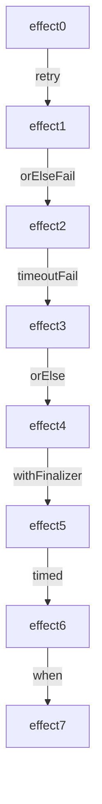

# Superpowers with Effects


Once programs are defined in terms of Effects, we use operations from the Effect System to manage different aspects of unpredictability.
Combining Effects with these operations feels like a superpower.
The reason we call them "superpowers" is that the operations can be attached to **any** Effect.
Operations can even be chained together.

Common operations like `timeout` are applicable to all Effects while some operations like `retry` are only applicable to a subset of Effects.

Ultimately this means we do not need to create bespoke operations for the many different Effects our system may have.

To illustrate this we will show a few examples of common operations applied to Effects.
Let's start with the "happy path" where we save a user to a database
(an Effect)
and then gradually add superpowers.

To start with we save a user to a database:

```scala
val userName =
  "Morty"
```

```scala
val effect0 =
  saveUser:
    userName
```

Effects can be run as "main" programs, embedded in other programs, or in tests.
To run an Effect with ZIO as a "main" program, we normally do this:

```scala
object MyApp extends ZIOAppDefault:
  def run =
    effect0
```

In this book, to avoid the excess lines, we shorten this to:

```scala
def run =
  effect0
```

Output:

```shell
Result: User saved
```

By default, the `saveUser` Effect runs in the "happy path" so it will not fail.

We can explicitly specify the way in which this Effect will run by overriding the `bootstrap` value:

```scala
override val bootstrap =
  happyPath

def run =
  effect0
```

Output:

```shell
Result: User saved
```

In real systems, assuming the "happy path" leaves strange unhandled errors lurking in your code.

We override the `bootstrap` value to simulate failures in the following examples.

```scala
override val bootstrap =
  neverWorks

def run =
  effect0
```

Output:

```shell
Log: **Database crashed!!**
Result: **Database crashed!!**
```

The program logs and returns the failure.

## Superpower: Persevering Through Failure

Sometimes things work when you keep trying.  
We can retry `effect0` with the `retryN` operation:

```scala
val effect1 =
  effect0.retryN(2)
```

The Effect with the retry behavior becomes a new Effect and can optionally be assigned to a `val` (as is done here).

Now we run the new Effect in a scenario that works on the third try:

```scala
override val bootstrap =
  doesNotWorkInitially

def run =
  effect1
```

Output:

```shell
Log: **Database crashed!!**
Log: **Database crashed!!**
Result: User saved
```

The output shows that running the Effect worked after two retries.

### What If It Never Succeeds?

In the `neverWorks` scenario, the Effect fails its initial attempt and subsequent retries:

```scala
override val bootstrap =
  neverWorks

def run =
  effect1
```

Output:

```shell
Log: **Database crashed!!**
Log: **Database crashed!!**
Log: **Database crashed!!**
Result: **Database crashed!!**
```

After the failed retries, the program returns the error.

## Superpower: Nice Error Messages

Let's define a new Effect that chains a nicer error onto the previously defined operations (the retries) using `orElseFail` which transforms any failure into a user-friendly error:

```scala
val effect2 =
  effect1.orElseFail:
    "ERROR: User could not be saved"
```

We altered the behavior without restructuring the original Effect.
Running this new Effect in the `neverWorks` scenario will produce the error:

```scala
override val bootstrap =
  neverWorks

def run =
  effect2
```

Output:

```shell
Log: **Database crashed!!**
Log: **Database crashed!!**
Log: **Database crashed!!**
Result: ERROR: User could not be saved
```

The `orElseFail` is combined with the prior Effect that has the retry,
  creating another new Effect that has both error handling operations.

## Superpower: Imposing Time Limits

Sometimes an Effect fails quickly, as we saw with retries.
Sometimes an Effect taking too long is itself a failure.
The `timeoutFail` operation can be chained to our previous Effect to specify a maximum time the Effect can run for, before producing an error:

```scala
val effect3 =
  effect2
    .timeoutFail("*** Save timed out ***"):
      5.seconds
```

If the effect does not complete within the time limit, it is canceled and returns our error message.
Timeouts can be added to any Effect.

Running the new Effect in the `slow` scenario causes it to take longer than the time limit:

```scala
override val bootstrap =
  slow

def run =
  effect3
```

Output:

```shell
Log: Interrupting slow request
Result: *** Save timed out ***
```

The Effect took too long and produced the error.

## Superpower: Fallback From Failure

In some cases there may be fallback behavior for failed Effects.
One option is to use the `orElse` operation with a fallback Effect:

```scala
val effect4 =
  effect3.orElse:
    sendToManualQueue:
      userName
```

`sendToManualQueue` represents something we can do when the user can't be saved.

Let's run the new Effect in the `neverWorks` scenario to ensure we reach the fallback:

```scala
override val bootstrap =
  neverWorks

def run =
  effect4
```

Output:

```shell
Log: **Database crashed!!**
Log: **Database crashed!!**
Log: **Database crashed!!**
Result: Please manually provision Morty
```

The retries do not succeed so the user is sent to the fallback Effect.

## Superpower: Add Some Logging

We want to ensure that some logging happens after the logic completes, regardless of failures.

```scala
val effect5 =
  effect4.withFinalizer:
    _ => logUserSignup
```

`withFinalizer` lets us attach this behavior, without changing the types of the original effect.

```scala
override val bootstrap =
  happyPath

def run =
  effect5
```

Output:

```shell
Log: Signup initiated for Morty
Result: User saved
```

We run the effect again in the `HappyPath` scenario to demonstrate running the Effects in parallel.

We can add all sorts of custom behavior to our Effect type,
  and then invoke them regardless of error and result types.

## Superpower: How Long Do Things Take?

For diagnostic information you can track timing:

```scala
val effect6 =
  effect5.timed
```

```scala
override val bootstrap =
  happyPath

def run =
  effect6
```

Output:

```shell
Log: Signup initiated for Morty
Result: (PT5.025312125S,User saved)
```

We run the Effect in the "HappyPath" Scenario; now the timing information is packaged with the original output `String`.

## Superpower: Maybe We Don't Want To Run Anything

Now that we have added all of these superpowers to our process,
  our lead engineer lets us known that a certain user should be prevented from using our system.

```scala
val effect7 =
  effect6.when(userName != "Morty")
```

```scala
override val bootstrap =
  happyPath

def run =
  effect7
```

Output:

```shell
Result: None
```

We can add behavior to the end of our complex Effect,
  that prevents it from ever executing in the first place.

## Many More Superpowers

{{ todo: Group discussion about this. Make rendering in manuscript work. Or hard-code the resulting graph image. }}



These examples have shown only a glimpse into the superpowers we can add to **any** Effect.
There are even more we will explore in the following chapters.

## Deferred Execution Enables many of the Superpowers

If these effects were all executed immediately, we would not be able to freely tack on new behaviors.
We cannot timeout something that might have already started running, or even worse - completed, before we get our hands on it.
We cannot retry something if we are only holding on to the completed result.
We cannot parallelize operations if they have already started single-threaded execution.

We need to be holding on to a value that represents something that _can_ be run, but hasn't yet.
If we have that, then our Effect System can freely add behavior before/after that value.

### defer/run example

When we make a defer block, nothing inside of it will be executed yet.

```scala
val program =
  defer:
    Console.printLine("Hello").run
    Console.printLine("world").run
```

The `.run` method is only available on our Effect values.
We explicitly call `.run` whenever we want to sequence our effects.
If we do not call `.run`, then we are just going to have an un-executed effect.
We want this explicit control, so that we can manipulate our effects up until it is time to run them.

When you have finished assembling your program, and you are ready to run it, you utilize the other important `run` method.

```scala
val run =
  program
```

Output:

```shell
Hello
world
```

Having 2 versions of `run` can be confusing, but they each serve a different purpose.

- The `.run` method attached to effects in a `defer` indicates when that effect will execute within the program.
  - This can happen many times throughout your program.
- Assigning your program to `def run` method will actually execute the program.
  - This typically happens only once in your code.

We focus on the `.run` method in this section.

You can only call `.run` on an effect value.
Attempting to use in on anything else will produce an error.


```scala
val program =
  defer:
    (1 + 1).run
```

Output:

```shell
error:
value run is not a member of Int.
An extension method was tried, but could not be fully constructed:

    run[R, E, A](1.+(1))

    failed with:

        Found:    (2 : Int)
        Required: ZIO[Nothing, Any, Any]
    program.repeatN(1).run
                   ^
```

```scala
def run =
  defer:
    program.repeatN(1).run
```

Output:

```shell
Hello
world
Hello
world
```

We _cannot_ repeat our executed effect.

```scala
val programManipulatingBeforeRun =
  defer:
    program.run.repeatN(3)
```

Output:

```shell
error:
value repeatN is not a member of Unit
    Console.printLine("**After**").run
           ^
```

We get the same error as the previous example, because the once an effect has been `.run`, you only have the result, not the deferred computation.

Note that these calls to `.run` are all within a `defer` block, so when `program` is defined, we still have not actually executed anything.
We have described a program that knows the order in which to execute our individual effects _when the program is executed_.

```scala
val surroundedProgram =
  defer:
    Console.printLine("**Before**").run
    program.repeatN(1).run
    Console.printLine("**After**").run
```

Even now, we have not executed anything.
It is only when we pass our completed program over to the effect system that the program is executed.

```scala
def run =
  surroundedProgram
```

Output:

```shell
**Before**
Hello
world
Hello
world
**After**
```