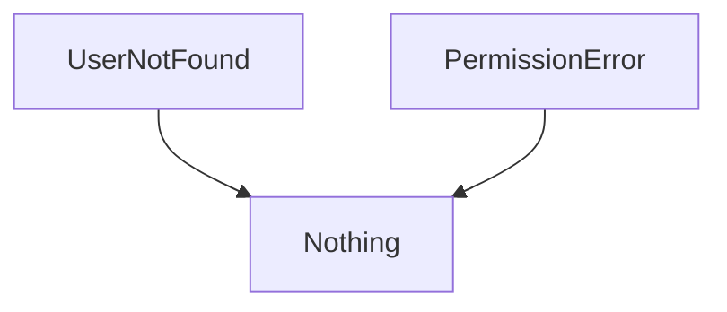
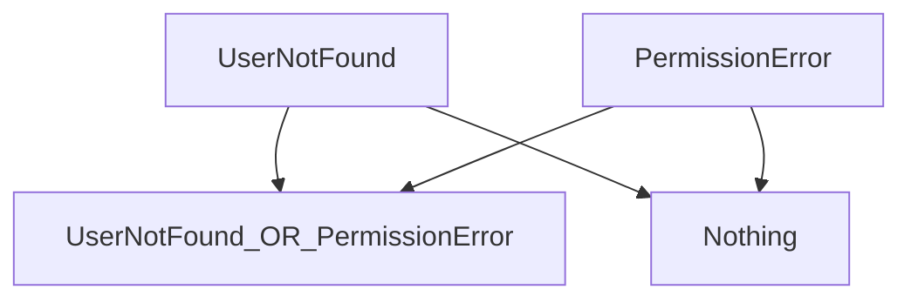
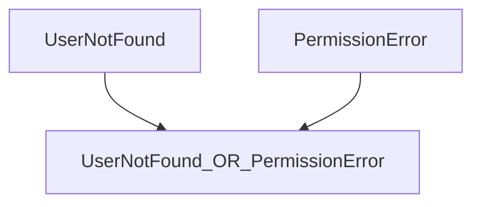

# Errors


[Edit This Chapter](https://github.com/EffectOrientedProgramming/book/edit/main/Chapters/06_Errors.md)


1. Why errors as values
1. Creating & Handling
   1. Flexible error types
1. Exhaustive checking
   1. Covering all possibles (`catchAll` not missing any)
   1. Do not handle impossible errors (`retry` not working if there is no error)
1. Collection of fallible operations (`collectAllSuccesses`)

In a language that cannot `throw`, following the execution path is simple, following 2 basic rules:

- At a branch, execute first match
- Otherwise, Read everything:
  - left-to-right
  - top-to-bottom,

Once you add `throw`, the rules are more complicated

- At a branch, execute first match
- Otherwise, Read everything
  - left-to-right
  - top-to-bottom
- Unless we `throw`, jumping through a different dimension


## Historic approaches to Error-handling
If you are not interested in the discouraged ways to handle errors, and just want to see the ZIO approach, jump down to
[ZIO Error Handling](#zio-error-handling)

## Throwing Exceptions

In the past, some programs have thrown exceptions to indicate failures.
Imagine a program that displays the local temperature the user based on GPS position and a network call. There are distinct levels of problems in any given program. They require different types of handling by the programmer.

```text
Temperature: 30 degrees
```


```scala
class GpsException()     extends Exception
class NetworkException() extends Exception

def render(value: String) =
  s"Temperature: $value"
```

```scala
def currentTemperatureUnsafe(): String =
  render:
    calculateTemp()

runScenario(
  scenario = Scenario.HappyPath,
  ZIO.succeed:
    currentTemperatureUnsafe()
)
// Result: Temperature: 35 degrees
```

On the happy path, everything looks as desired.
If the network is unavailable, what is the behavior for the caller?
This can take many forms.
If we don't make any attempt to handle our problem, the whole program blows up and shows the gory details to the user.

```scala
// Note - Can't make this output prettier/simpler because it's *not* using ZIO
// Actually, now that we're using ZIO, we can make this output prettier.
// But maybe we should use a different runScenario method that _doesn't_ use ZIO?
  
runScenario(
  scenario = Scenario.NetworkError,
  ZIO.succeed:
    currentTemperatureUnsafe()
)
// Result: Defect: NetworkException
```

## Returning `null` 

We could take the bare-minimum approach of catching the `Exception` and returning `null`:

```scala
def currentTemperatureNull(
    scenario: Scenario
): String =
  resetScenario(scenario)
  render:
    try
      calculateTemp()
    catch
      case ex: Exception =>
        null

currentTemperatureNull:
  Scenario.NetworkError
// res2: String = "Temperature: null"
```

This is *slightly* better, as the user can at least see the outer structure of our UI element, but it still leaks out code-specific details world.

## Sentinel Values

Maybe we could fallback to a `sentinel` value, such as `0` or `-1` to indicate a failure?

```scala
def currentTemperature(
    scenario: Scenario
): String =
  resetScenario(scenario)
  render:
    try
      calculateTemp()
    catch
      case ex: Exception =>
        "-1 degrees"

currentTemperature:
  Scenario.NetworkError
// res3: String = "Temperature: -1 degrees"
```

Clearly, this isn't acceptable, as both of these common sentinel values are valid temperatures.

## Diligent Catching, without any hints.
We can take a more honest and accurate approach in this situation.

```scala
def currentTemperature(
    scenario: Scenario
): String =
  resetScenario(scenario)
  render:
    try
      calculateTemp()
    catch
      case ex: Exception =>
        "Unavailable"

currentTemperature:
  Scenario.NetworkError
// res4: String = "Temperature: Unavailable"
```

We have improved the failure behavior significantly; is it sufficient for all cases?
Imagine our network connection is stable, but we have a problem in our GPS hardware.
In this situation, do we show the same message to the user? Ideally, we would show the user a distinct message for each scenario.
The Network issue is transient, but the GPS problem is likely permanent.

```scala
def currentTemperature(
    scenario: Scenario
): String =
  resetScenario(scenario)
  try
    render:
      calculateTemp()
  catch
    case ex: NetworkException =>
      "Network Unavailable"
    case ex: GpsException =>
      "GPS problem"

currentTemperature:
  Scenario.NetworkError
// res5: String = "Network Unavailable"

currentTemperature:
  Scenario.GPSError
// res6: String = "GPS problem"
```

Wonderful!
We have specific messages for all relevant error cases. However, this still suffers from downsides that become more painful as the codebase grows.

- The signature of `currentTemperature` does not alert us that it might fail
- If we realize it can fail, we must dig through the implementation to discover the multiple failure values
- We never have certainty about the failure paths of our full application, or any subset of it.

{{ TODO Tear apart exceptions more }}

Encountering an error during a function call generally means two things:

1. You can't continue executing the function in the normal fashion.

2. You can't return a normal result.

## More Problems with Exceptions

Many languages use *exceptions* for handling errors.
An exception *throws* out of the current execution path to locate a user-written *handler* to deal with the error.
There are two goals for exceptions:

1. Separate error-handling code from "success-path" code, so the success-path code is easier to understand and reason about.

2. Reduce redundant error-handling code by handling associated errors in a single place.

Exceptions have problems:

1. They aren't typed.
   Java's checked exceptions provide a small amount of type information, but it's not that helpful compared to a full type system.
   Unchecked exceptions provide no information at all.

1. Because they are handled dynamically, the only way to ensure your program
   won't crash is by testing it through all possible execution paths. A
   statically-typed error management solution can ensure---at compile
   time---that all errors are handled.

1. They don't scale, because its difficult to know what exceptions a function can throw.
   {{Need to think about this more to make the case.}}

1. Difficult or impossible to retry an operation if it fails.
   Java {{and Scala?}} use the "termination" model of exception handling.
   This assumes the error is so critical there's no way to get back to where the exception occurred.
   If you're performing an operation that you'd like to retry if it fails, exceptions don't help much.

Exceptions were a valiant attempt to produce a consistent error-reporting interface, and they are definitely better than what's in C.
But they don't end up solving the problem very well, and you just don't know what you're going to get when you use exceptions.


## ZIO Error Handling

Now we will explore how ZIO enables more powerful, uniform error-handling.

TODO {{Update verbiage now that ZIO section is first}}

- [ZIO Error Handling](#zio-error-handling)
- [Wrapping Legacy Code](#wrapping-legacy-code)

{#zio-error-handling}
### ZIO-First Error Handling

```scala
// TODO We hide the original implementation of this function, but show this one.
// Is that a problem? Seems unbalanced
val getTemperatureZ =
  getScenario() match
    case Scenario.GPSError =>
      ZIO.fail:
        GpsException()
    case Scenario.NetworkError =>
      // TODO Use a non-exceptional error
      ZIO.fail:
        NetworkException()
    case Scenario.HappyPath =>
      ZIO.succeed:
        "35 degrees"
// getTemperatureZ: ZIO[Any, GpsException | NetworkException, String] = OnSuccess(
//   trace = "repl.MdocSession.MdocApp.<local MdocApp>.getTemperatureZ(06_Errors.md:227)",
//   first = GenerateStackTrace(
//     trace = "repl.MdocSession.MdocApp.<local MdocApp>.getTemperatureZ(06_Errors.md:227)"
//   ),
//   successK = zio.ZIO$$$Lambda$15406/0x0000000803f03840@2bf69439
// )

runScenario(
  Scenario.HappyPath,
  getTemperatureZ
)
// Result: repl.MdocSession$MdocApp$GpsException
```

```scala
// TODO make MDoc:fail adhere to line limits?
runScenario(
  Scenario.HappyPath,
  getTemperatureZ
    .catchAll:
      case ex: NetworkException =>
        ZIO.succeed:
          "Network Unavailable"
)
// error: 
// match may not be exhaustive.
// 
// It would fail on pattern case: _: GpsException
//
```

TODO Demonstrate ZIO calculating the error types without an explicit annotation being provided

```scala
runScenario(
  Scenario.GPSError,
  getTemperatureZ
)
// Result: repl.MdocSession$MdocApp$GpsException
```

{#wrapping-legacy-code}
### Wrapping Legacy Code

If we are unable to re-write the fallible function, we can still wrap the call.

{{TODO }}

```scala
def calculateTempWrapped(scenario: Scenario) =
  resetScenario(scenario)
  ZIO.attempt:
    calculateTemp()
```


```scala
def displayTemperatureZWrapped(
    behavior: Scenario
) =
  calculateTempWrapped:
    behavior
  .catchAll:
    case ex: NetworkException =>
      ZIO.succeed:
        "Network Unavailable"
    case ex: GpsException =>
      ZIO.succeed:
        "GPS problem"
```

```scala
runDemo:
  displayTemperatureZWrapped:
    Scenario.HappyPath
// Result: 35 degrees
```

```scala
runDemo:
  displayTemperatureZWrapped:
    Scenario.NetworkError
// Result: Network Unavailable
```

This is decent, but does not provide the maximum possible guarantees. Look at what happens if we forget to handle one of our errors.

```scala
def getTemperatureZGpsGap(behavior: Scenario) =
  calculateTempWrapped:
    behavior
  .catchAll:
    case ex: NetworkException =>
      ZIO.succeed:
        "Network Unavailable"
```

```scala
runDemo:
  getTemperatureZGpsGap:
    Scenario.GPSError
// Result: Defect: GpsException
```

The compiler does not catch this bug, and instead fails at runtime.
Take extra care when interacting with legacy code, since we cannot automatically recognize these situations at compile time.
We can provide a fallback case that will report anything we missed:

```scala
def getTemperatureZWithFallback(
    behavior: Scenario
) =
  calculateTempWrapped:
    behavior
  .catchAll:
    case ex: NetworkException =>
      ZIO.succeed:
        "Network Unavailable"
    case other =>
      ZIO.succeed:
        "Error: " + other
```

```scala
runDemo:
  getTemperatureZWithFallback:
    Scenario.GPSError
// Result: Error: repl.MdocSession$MdocApp$GpsException
```

This lets us avoid the most egregious gaps in functionality, but it does not take full advantage of ZIO's type-safety.

> Note: The following is copy&pasted and needs work

## Unions AKA Sum Types AKA Enums AKA Ors

Note - Avoid official terminology in most prose. Just say "And"/"Or" where appropriate.

Scala 3 automatically aggregates the error types by synthesizing an anonymous sum type from the combined errors.

Functions usually transform the `Answer` from one type to another type.  Errors often aggregate.


Consider 2 error types

```scala
case class UserNotFound()
case class PermissionError()
```

In the type system, the most recent ancestor between them is `Any`.  
Unfortunately, you cannot make any meaningful decisions based on this type.



We need a more specific way to indicate that our code can fail with either of these types.
The `|` (or) tool provides maximum specificity without the need for inheritance.

*TODO* Figure out how to use pipe symbol in Mermaid



Often, you do not care that `Nothing` is involved at all.
The mental model can be simply:



```scala
case class UserService()
```

```scala
case class User(name: String)
case class SuperUser(name: String)

def getUser(
    userId: String
) =
   if (userId == "morty" || userId = "rick")
     ZIO.succeed:
       User(userId)
   else
     ZIO.fail:
       UserNotFound()

def getSuperUser(
    user: User
) =
  if (user.name = "rick")
    ZIO.succeed:
      SuperUser(user.name)
  else
    ZIO.fail:
      PermissionError()

def loginSuperUser(userId: String) =
  defer:
    val basicUser = getUser(userId).run
    getSuperUser(basicUser).run

```
