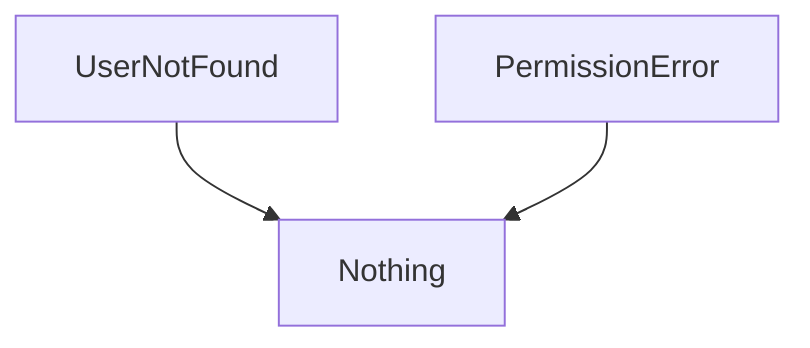
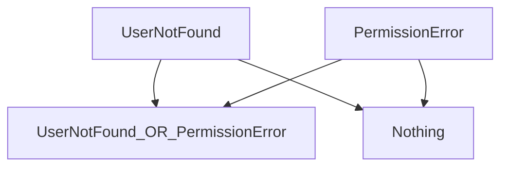
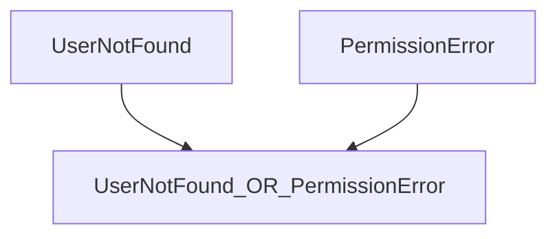

# Errors


[Edit This Chapter](https://github.com/EffectOrientedProgramming/book/edit/main/Chapters/06_Errors.md)


1. Why errors as values
1. Creating & Handling
   1. Flexible error types
1. Collection of fallible operations (`collectAllSuccesses`)

## Our program for this chapter

We want to show the user a page that shows the current temperature at their location
It will look like this

```text
Temperature: 30 degrees
```

There are 2 error situations we need to handle:

 - Network call to weather service fails.
 - A fault in our GPS hardware

We want our program to always result in a sensible message to the user.


## Throwing Exceptions

Throwing exceptions is one way indicate failure.

In a language that cannot `throw`, following the execution path is simple, following 2 basic rules:

- At a branch, execute first match
- Otherwise, Read everything:
  - left-to-right
  - top-to-bottom,

Once you add `throw`, the world gets more complicated.

- Unless we `throw`, jumping through a different dimension


```scala
class GpsException()     extends Exception
class NetworkException() extends Exception

def render(value: String) =
  s"Temperature: $value"
```

```scala
def currentTemperatureUnsafe(): String =
  render:
    calculateTemp()

runScenario(
  scenario =
    Scenario.HappyPath,
  ZIO.attempt:
    currentTemperatureUnsafe()
)
// Temperature: 35 degrees
```

On the happy path, everything looks as desired.
If the network is unavailable, what is the behavior for the caller?
If we don't make any attempt to handle our problem, the whole program blows up and shows the gory details to the user.

```scala
runScenario(
  scenario =
    Scenario.NetworkError,
  ZIO.succeed:
    currentTemperatureUnsafe()
)
// Defect: NetworkException
```

## Manual Error Discovery

If you have been burned in the past by functions that throw surprise exceptions
  , you might defensively catch `Exception`s all over your program.
For this program, it could look like:

```scala
def currentTemperature(): String =
    try
      render:
        calculateTemp()
    catch
      case ex: Exception =>
        "Failure"

runScenario(
  Scenario.NetworkError,
  ZIO.succeed:
    currentTemperature()
)
// Failure
```

We have improved the failure behavior significantly; is it sufficient for all cases?
Imagine our network connection is stable, but we have a problem in our GPS hardware.
In this situation, do we show the same message to the user? Ideally, we would show the user a distinct message for each scenario.
The Network issue is transient, but the GPS problem is likely permanent.

```scala
def currentTemperature(): String =
  try
    render:
      calculateTemp()
  catch
    case ex: NetworkException =>
      "Network Unavailable"
    case ex: GpsException =>
      "GPS Hardware Failure"

runScenario(
  Scenario.NetworkError,
  ZIO.succeed:
    currentTemperature()
)
// Network Unavailable

runScenario(
  Scenario.GPSError,
  ZIO.succeed:
    currentTemperature()
)
// GPS Hardware Failure
```

Wonderful!
We have specific messages for all relevant error cases. However, this still suffers from downsides that become more painful as the codebase grows.

- We do not know if `currentTemperature` can fail
- Once we know it can fail, we must dig through the documentation or implementation to discover the different possibilities
- Because every function that is called by `currentTemperature` can call other functions, which can call other functions, and so on,
   we are never sure that we have found all the failure paths in our application

## More Problems with Exceptions

Exceptions have other problems:

1. The only way to ensure your program won't crash is by testing it through all possible execution paths. 

1. It is difficult or impossible to retry an operation if it fails.

Exceptions were a valiant attempt to produce a consistent error-reporting interface, and they are better than what came before.
You just don't know what you're going to get when you use exceptions.

## ZIO Error Handling

Now we will explore how ZIO enables more powerful, uniform error-handling.

TODO {{Update verbiage now that ZIO section is first}}

- [ZIO Error Handling](#zio-error-handling)
- [Wrapping Legacy Code](#wrapping-legacy-code)

{#zio-error-handling}
### ZIO-First Error Handling

```scala
// TODO We hide the original implementation of this function, but show this one.
// Is that a problem? Seems unbalanced
val getTemperatureZ =
  getScenario() match
    case Scenario.GPSError =>
      ZIO.fail:
        GpsException()
    case Scenario.NetworkError =>
      // TODO Use a non-exceptional error
      ZIO.fail:
        NetworkException()
    case Scenario.HappyPath =>
      ZIO.succeed:
        "35 degrees"
// getTemperatureZ: ZIO[Any, GpsException | NetworkException, String] = OnSuccess(
//   trace = "repl.MdocSession.MdocApp.<local MdocApp>.getTemperatureZ(06_Errors.md:178)",
//   first = GenerateStackTrace(
//     trace = "repl.MdocSession.MdocApp.<local MdocApp>.getTemperatureZ(06_Errors.md:178)"
//   ),
//   successK = zio.ZIO$$$Lambda$15353/0x0000000803f04040@5d6ce76
// )

runScenario(Scenario.HappyPath, getTemperatureZ)
// repl.MdocSession$MdocApp$GpsException
```

```scala
// TODO make MDoc:fail adhere to line limits?
runScenario(
  Scenario.GPSError,
  getTemperatureZ.catchAll:
    case ex: NetworkException =>
      ZIO.succeed:
        "Network Unavailable"
)
// error:
// match may not be exhaustive.
// 
// It would fail on pattern case: _: GpsException
// 
//     case ex: NetworkException =>
//     ^
```

```scala
runScenario(Scenario.GPSError, getTemperatureZ)
// repl.MdocSession$MdocApp$GpsException
```

```scala
val renderTempZTotal =
  getTemperatureZ.catchAll:
    case ex: NetworkException =>
      ZIO.succeed:
        "Network Unavailable"
    case ex: GpsException =>
      ZIO.succeed:
        "New GPS Hardware needed"
```

```scala
runScenario(
  Scenario.GPSError,
  renderTempZTotal
)
// New GPS Hardware needed
```

Now that we have handled all of our errors, we know we are showing the user a sensible message.
Therefore - it would not make sense to retry this rendering.
Note - this is different from retrying the call to get the temperature itself.

```scala
runScenario(
  Scenario.GPSError,
  renderTempZTotal
    .retryN(10)
)
// error: 
// This error handling operation assumes your effect can fail. However, your effect has Nothing for the error type, which means it cannot fail, so there is no need to handle the failure. To find out which method you can use instead of this operation, please see the reference chart at: https://zio.dev/can_fail.
// I found:
// 
//     CanFail.canFail[E](/* missing */summon[scala.util.NotGiven[E =:= Nothing]])
// 
// But no implicit values were found that match type scala.util.NotGiven[E =:= Nothing].
```

Thanks to the type management provided by our effect library
, the compiler recognizes that this `retryN` can never be used and prevents us from adding it.

{#wrapping-legacy-code}
### Wrapping Legacy Code

If we are unable to re-write the fallible function, we can still wrap the call.

```scala
val calculateTempWrapped =
  ZIO.attempt:
    calculateTemp()
```

```scala
val displayTemperatureZWrapped =
  calculateTempWrapped.catchAll:
    case ex: NetworkException =>
      ZIO.succeed:
        "Network Unavailable"
    case ex: GpsException =>
      ZIO.succeed:
        "GPS problem"
```

```scala
runScenario(
  Scenario.HappyPath,
  displayTemperatureZWrapped
)
// 35 degrees
```

```scala
runScenario(
  Scenario.NetworkError,
  displayTemperatureZWrapped
)
// Network Unavailable
```

This is decent, but does not provide the maximum possible guarantees. 
Look at what happens if we forget to handle one of our errors.


```scala
runScenario(
  Scenario.GPSError,
  calculateTempWrapped.catchAll:
    case ex: NetworkException =>
      ZIO.succeed:
        "Network Unavailable"
)
// Defect: GpsException
```

The compiler does not catch this bug, and instead fails at runtime.
Take extra care when interacting with legacy code
, since we cannot automatically recognize these situations at compile time.
We can provide a fallback case that will report anything we missed:

```scala
runScenario(
  Scenario.GPSError,
  calculateTempWrapped.catchAll:
    case ex: NetworkException =>
      ZIO.succeed:
        "Network Unavailable"
    case other =>
      // TODO Decide if succeed is right
      ZIO.succeed:
        "Error: " + other
)
// Error: repl.MdocSession$MdocApp$GpsException
```

This lets us avoid the most egregious gaps in functionality, but it does not take full advantage of ZIO's type-safety.

> Note: The following is copy&pasted and needs work

## Unions AKA Sum Types AKA Enums AKA Ors

Note - Avoid official terminology in most prose. Just say "And"/"Or" where appropriate.

Scala 3 automatically aggregates the error types by synthesizing an anonymous sum type from the combined errors.

Functions usually transform the `Answer` from one type to another type.  Errors often aggregate.


Consider 2 error types

```scala
case class UserNotFound()
case class PermissionError()
```

In the type system, the most recent ancestor between them is `Any`.  
Unfortunately, you cannot make any meaningful decisions based on this type.



We need a more specific way to indicate that our code can fail with either of these types.
The `|` (or) tool provides maximum specificity without the need for inheritance.

*TODO* Figure out how to use pipe symbol in Mermaid



Often, you do not care that `Nothing` is involved at all.
The mental model can be simply:



```scala
case class UserService()
```

```scala
case class User(name: String)
case class SuperUser(name: String)

def getUser(
    userId: String
) =
   if (userId == "morty" || userId = "rick")
     ZIO.succeed:
       User(userId)
   else
     ZIO.fail:
       UserNotFound()

def getSuperUser(
    user: User
) =
  if (user.name = "rick")
    ZIO.succeed:
      SuperUser(user.name)
  else
    ZIO.fail:
      PermissionError()

def loginSuperUser(userId: String) =
  defer:
    val basicUser = getUser(userId).run
    getSuperUser(basicUser).run

```
